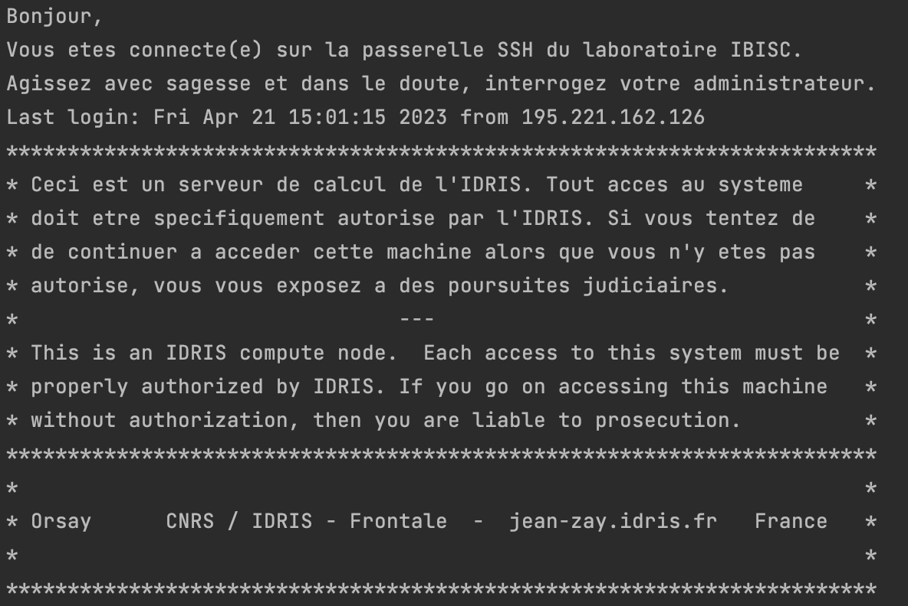

# Jean Zay Connection


To connect to the Jean Zay, you need to have your username and password (sent by mail).

## First connection


1. Connect to the IBISC bastion:
  
Connect the the IBISC bastion. You need to have your IBISC username.

```bash
ssh <USERNAME_IBISC>@ssh2.ibisc.univ-evry.fr
```

2. Connect to Jean Zay:

You need to have your Jean Zay username (obtained from mail). It usually starts with `ulg`. 

```bash
ssh <USERNAME_JEAN_ZAY>@jean-zay.idris.fr
```
## SSH connection 

In order to connect easily, you can change your `~/.ssh/config` file. 

1. Add public key to Jean Zay authorized keys 
    
Check that you have your public ssh key in the `~/.ssh/authorized_keys` file in Jean Zay. 
            
2. Add your bastion in your config file 

As we connect to Jean Zay through the IBISC bastion, you can add it to your `~/.ssh/config` file (locally). 

```bash
Host bastion-host
Hostname ssh2.ibisc.univ-evry.fr
User <USERNAME>
IdentityFile ~/.ssh/<SSH_PUBLIC_KEY>
```

Replace `<USERNAME>` with your IBISC `username` and `<SSH_PUBLIC_KEY>` with your ssh provided to connect to the bastion.

3. Add Jean Zay in your config file

Now you can add Jean Zay connection to your `~/ssh/.config` file (locally): 

```bash
Host jean_zay
User <USERNAME_JEAN_ZAY>
Hostname jean-zay.idris.fr
ProxyJump bastion-host
IdentityFile ~/.ssh/<SSH_PUBLIC_KEY_JEAN_ZAY> 
```

Replace `<USERNAME_JEAN_ZAY>` by your Jean Zay username (provided by mail), and `<SSH_PUBLIC_KEY_JEAN_ZAY>` your ssh key that you added to the Jean Zay authorized key. 

4. Connect to Jean Zay

You can now connect to Jean Zay using `ssh jean_zay`.

You should see something like this:


## SSH connection


