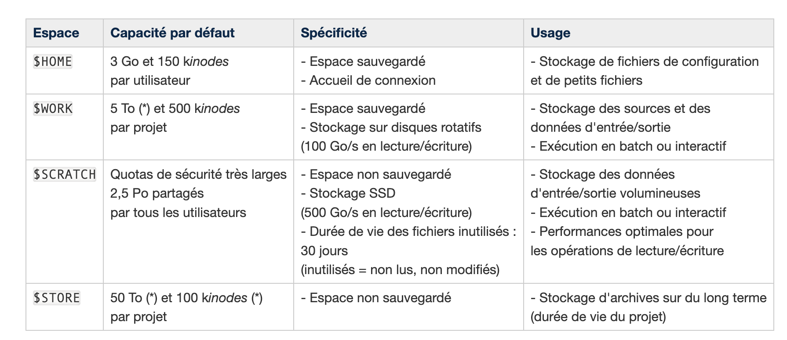

# Directories

When you are in Jean Zay, there are specific directories to be aware of. 

Here is a list of the different directories.

| Size  |  Backup  | Usage |  Variable    | Multi-project | 
| -------- | -------- | -------- | -------- | -------- |
| Home    | Small   | Yes | Small size files, for configuration | $HOME   | One Home for everyone | 
| Work    | High (but limited by a quota per project) |   Yes | Coding space: source code, library, data, etc   | $WORK   | One Work per project |
| Scratch | High    | No  | Large files that can be deleted (large datasets)    | $SCRATCH    | One scratch per project | 
| JobScratch |  High |   No |  Large files for a job run only.  |    $JOBSCRATCH | One per run | 
| Store   | High    | No  | Large files for long term storage   | $STORE  | One store per project | 
| DSDIR   | High    | -   | Public dataset  | $DSDIR  | - |

A summary of the different spaces: 

### Home

We can access it with the `$HOME` variable.
This is a space with small amount of memory. This is used for the small variables, like the shell environment variables. 

### Work

Work space and storage. It can be found in `$WORK`. We store the files needed for the `batch` utilisation : library, source code, data, etc. 

There is a space where we can share with everyone: **`ALL_CCFRWORK**`

### SCRATCH/JOBSCRATCH

Work space to be used by batch, accessible with `$SCRATCH`. The folder is refreshed every **30 days.** 

It is used for large files and should be then copy paste in the `$WORK` directory to be saved. 

The path **`ALL_CCFRSCRATCH`** is a shared directory between projects.``

### Store

Archiving space, accessible through `$STORE`. This is used to be stored for a long time, and to not accessed frequently. 

There is also a space shared for projects, accessible with **`$ALL_CCFRSTORE`** command**.**

### DSDIR

Path with the public datasets available, accessible with `$DSDIR`. 

`$HOME` and `$WORK` are saved regularly through snapshots. This is accessible on the different directories with the `ls .snapshots` command. 

### Source

- (Official documentation)[http://www.idris.fr/static/intro/doc_nouvel_utilisateur.html]: 7.Présentation des espaces disques
